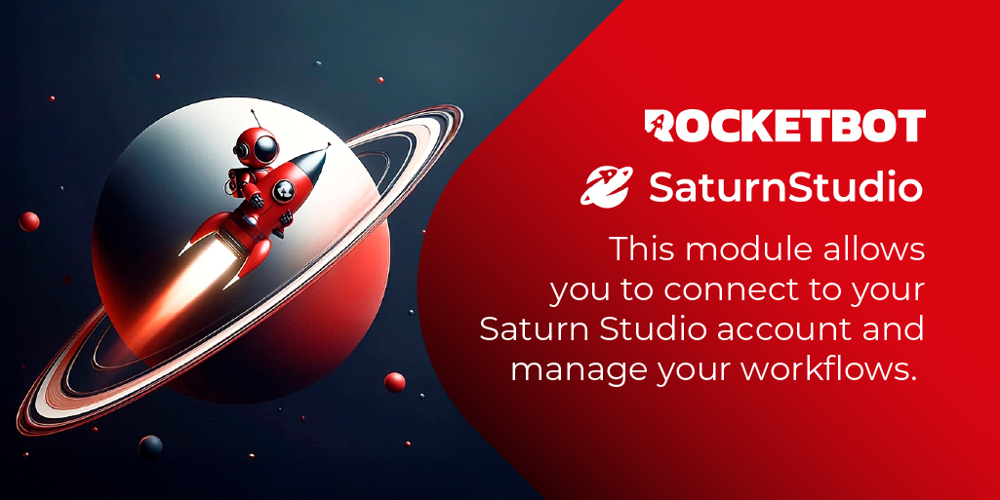

# Saturn Studio
  
Este módulo permite que você se conecte à sua conta Saturn Studio e gerencie seus fluxos de trabalho.  

*Read this in other languages: [English](Manual_SaturnStudio.md), [Português](Manual_SaturnStudio.pr.md), [Español](Manual_SaturnStudio.es.md)*
  

## Como instalar este módulo
  
Para instalar o módulo no Rocketbot Studio, pode ser feito de duas formas:
1. Manual: __Baixe__ o arquivo .zip e descompacte-o na pasta módulos. O nome da pasta deve ser o mesmo do módulo e dentro dela devem ter os seguintes arquivos e pastas: \__init__.py, package.json, docs, example e libs. Se você tiver o aplicativo aberto, atualize seu navegador para poder usar o novo módulo.
2. Automático: Ao entrar no Rocketbot Studio na margem direita você encontrará a seção **Addons**, selecione **Install Mods**, procure o módulo desejado e aperte instalar.  

## Descrição do comando

### Conectar
  
Conectar com Saturn Studio usando sua API Key.
|Parâmetros|Descrição|exemplo|
| --- | --- | --- |
|API Key|API Key para Saturn Studio|eyJhbGciOi...|
|Atribuir resultado a variável|Variável onde o resultado da conexão será armazenado|Variável|

### Executar workflow
  
Executar um fluxo de trabalho na sua conta do Saturn Studio.
|Parâmetros|Descrição|exemplo|
| --- | --- | --- |
|Workflow URL|Workflow URL para Saturn Studio|https://studio.rocketbot.com/flow?d=xxxx&i=yyyy&r=e|
|Atribuir resultado a variável|Variável onde o resultado da conexão será armazenado|Variável|

### Carregar arquivo para o File Storage
  
Carregue um arquivo para o File Storage da sua conta do Saturn Studio.
|Parâmetros|Descrição|exemplo|
| --- | --- | --- |
|Caminho do Arquivo|Caminho do arquivo a ser carregado|C:/Users/User/Downloads/file.file|
|Atribuir resultado a variável|Nome da variável onde o resultado será armazenado|Variável|

### Listar todos os arquivos no File Storage
  
Retorna uma lista com todos os arquivos no File Storage da sua conta do Saturn Studio.
|Parâmetros|Descrição|exemplo|
| --- | --- | --- |
|Atribuir resultado a variável|Retorna uma lista com todos os arquivos no File Storage da sua conta do Saturn Studio|Variável|

### Excluir um arquivo do File Storage
  
Exclui um arquivo do File Storage da sua conta do Saturn Studio.
|Parâmetros|Descrição|exemplo|
| --- | --- | --- |
|ID do arquivo|ID do arquivo a ser excluído no File Storage da sua conta do Saturn Studio|Arquivo|
|Atribuir resultado a variável|Nome da variável onde o resultado será armazenado|Variável|

### Baixar arquivo do File Storage
  
Baixe um arquivo do File Storage da sua conta do Saturn Studio.
|Parâmetros|Descrição|exemplo|
| --- | --- | --- |
|ID do arquivo|ID do arquivo a ser baixado no File Storage da sua conta do Saturn Studio|Arquivo|
|Caminho do Arquivo|Caminho do arquivo a ser carregado|C:/Users/User/Downloads/|
|Nome do arquivo|Nome do arquivo a ser salvo|file.jpg|
|Atribuir resultado a variável|Nome da variável onde o resultado será armazenado|Variável|

### Listar todos os robôs no Saturn Studio
  
Retorna uma lista com todos os robôs da sua conta do Saturn Studio.
|Parâmetros|Descrição|exemplo|
| --- | --- | --- |
|Atribuir resultado a variável|Retorna uma lista com todos os robôs da sua conta do Saturn Studio|Variável|
|Filtrar robôs ativos|Marque para listar apenas os robôs ativos|True|

### Parar todos os robôs em execução
  
Para todos os robôs em execução na sua conta do Saturn Studio.
|Parâmetros|Descrição|exemplo|
| --- | --- | --- |
|Atribuir resultado a variável|Variável onde o resultado da desativação dos robôs será armazenado|Variável|

### Listar Data Stores
  
Este comando permite que você obtenha todos os Data Stores da sua conta Saturn Studio
|Parâmetros|Descrição|exemplo|
| --- | --- | --- |
|Atribuir resultado a variável|Variável onde os Data Stores da sua conta Saturn Studio serão armazenados|Variável|

### Buscar Data Store
  
Este comando permite que você obtenha um Data Store usando seu ID ou Nome na sua conta Saturn Studio
|Parâmetros|Descrição|exemplo|
| --- | --- | --- |
|Tipo de dado a ser pesquisado|Selecione se deseja pesquisar o Data Store pelo seu ID ou Nome na sua conta Saturn Studio|ID|
|Nome ou ID do Data Store|Nome ou ID do Data Store a ser pesquisado na sua conta Saturn Studio|my_data_store | ID|
|Atribuir resultado a variável|Variável onde as informações dos registros obtidos do Data Store na sua conta Saturn Studio serão armazenadas|Variável|

### Criar Data Store
  
Este comando permite que você crie um Data Store na sua conta Saturn Studio
|Parâmetros|Descrição|exemplo|
| --- | --- | --- |
|Nome do Data Store|Nome que o Data Store criado na sua conta Saturn Studio terá|Meu novo Data Store|
|Descrição do Data Store (opcional)|Descrição que o Data Store criado na sua conta Saturn Studio terá|Descrição do Data Store (opcional)|
|Atribuir resultado a variável|Variável onde as informações do Data Store criado na sua conta Saturn Studio serão armazenadas|Variável|

### Adicionar registro ao Data Store
  
Este comando permite que você adicione um registro a um Data Store na sua conta Saturn Studio
|Parâmetros|Descrição|exemplo|
| --- | --- | --- |
|ID do Data Store|ID do Data Store onde o registro será adicionado na sua conta Saturn Studio|e88d5dfd3c59f0f5fbb908d0f6aaf7ab|
|Registro para adicionar (formato JSON)|Registro que será adicionado ao Data Store na sua conta Saturn Studio|{
  "nome": "João",
  "idade": 30
}|
|Atribuir resultado a variável|Variável onde as informações do registro adicionado ao Data Store na sua conta Saturn Studio serão armazenadas|Variável|

### Obter registros do Data Store
  
Este comando permite que você obtenha registros de um Data Store na sua conta Saturn Studio
|Parâmetros|Descrição|exemplo|
| --- | --- | --- |
|ID do Data Store|ID do Data Store de onde os registros serão obtidos na sua conta Saturn Studio|e88d5dfd3c59f0f5fbb908d0f6aaf7ab|
|Filtro Personalizado|Apenas os registros que contiverem o texto especificado no filtro serão obtidos. Deixe este campo vazio para obter todos os registros.|"nome": "João"|
|Atribuir resultado a variável|Variável onde as informações dos registros obtidos do Data Store na sua conta Saturn Studio serão armazenadas|Variável|

### Listar robôs compartilhados
  
Retorna uma lista com os robôs compartilhados com você no Saturn Studio.
|Parâmetros|Descrição|exemplo|
| --- | --- | --- |
|Atribuir resultado a variável|Variável onde a lista de robôs compartilhados será armazenada|Variável|

### Executar robô compartilhado
  
Execute um robô compartilhado informando Project ID e Robot ID.
|Parâmetros|Descrição|exemplo|
| --- | --- | --- |
|Team ID|ID do time que possui o robô compartilhado|team_id|
|Robot ID|ID do robô compartilhado para executar|robot_id|
|Atribuir resultado a variável|Variável onde o resultado da execução será armazenado|Variável|
